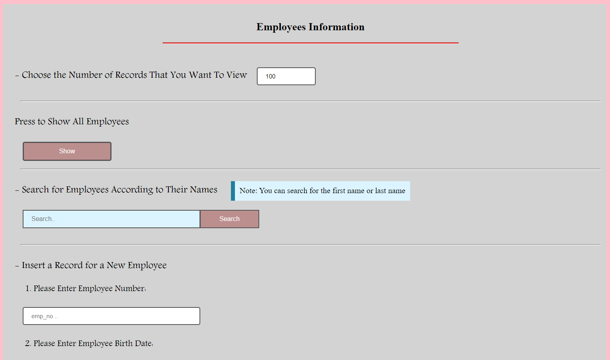
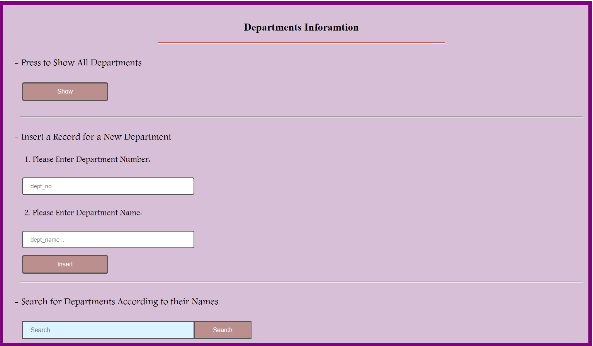

# Springboot-EmplyeeFinder

This website support the following features:

          1. View for Employees information that allows the user to:
             a.	Show all employees names associated with their titles, departments and salaries.
             b.	Allow search for an employee based on: userId.
             c.	Insert a record for a new employee.

          2. View for Departments information that allows the user to:
             a.	Show all departments, and their managers.
             b.	Search for a department and show the employees-names who belong to it.
             c.	Insert a record for a new department.

Project Preview:

